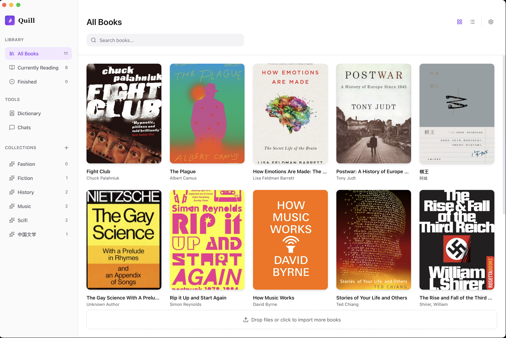
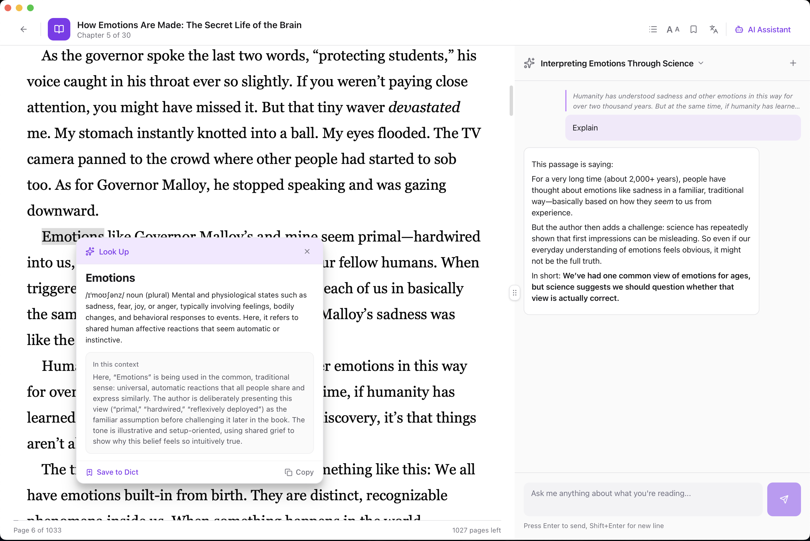

# Quill

An eBook reader with a built-in AI reading assistant — powered by your existing ChatGPT subscription. No API keys, no extra costs. Just sign in and start reading with AI.

<table>
  <tr>
    <td></td>
    <td></td>
  </tr>
  <tr>
    <td align="center"><em>Library</em></td>
    <td align="center"><em>Reader with AI chat & word lookup</em></td>
  </tr>
</table>

## Features

### Reading
- **EPUB & PDF** — Paginated and scrolled modes with customizable fonts, spacing, and margins
- **Highlights & Bookmarks** — Color-coded highlights with notes
- **Vocabulary** — Save words with context, track mastery with spaced repetition

### AI
- **Chat Assistant** — Ask questions about passages, get explanations, discuss themes — with your highlighted text as context
- **Word Lookup** — Select any word for instant definitions, contextual meaning, or deep explanations
- **Multiple Providers** — OpenAI (OAuth or API key), Anthropic, Ollama (local), OpenAI-compatible, MiniMax

### Organization
- **Library** — Grid/list views, search, status filters, collections
- **iCloud Sync** — Sync books, progress, and settings across Macs
- **i18n** — English and Simplified Chinese

## Download

Grab the latest `.dmg` from the [Releases](https://github.com/yicheng47/quill/releases) page:

| File | Platform |
|------|----------|
| `Quill_x.x.x_aarch64.dmg` | macOS Apple Silicon (M1/M2/M3/M4) |
| `Quill_x.x.x_x64.dmg` | macOS Intel |

Open the `.dmg` and drag **Quill.app** to your Applications folder.

## AI Setup

Quill supports multiple AI providers. Configure in Settings:

| Provider | Setup |
|----------|-------|
| **OpenAI (OAuth)** (default) | Sign in with your OpenAI account — uses your existing ChatGPT subscription, no API key or extra payment needed |
| **Ollama** | Install [Ollama](https://ollama.com/), run `ollama pull llama3.2`, no API key needed |
| **OpenAI (API key)** | Add your OpenAI API key (pay-per-use) |
| **Anthropic** | Add your API key |
| **OpenAI-compatible** | Any OpenAI-compatible endpoint (e.g. local models, third-party hosts) |
| **MiniMax** | Add your API key |

<details>
<summary><h2 style="display:inline">Development</h2></summary>

### Tech Stack

- **Frontend**: React 19, TypeScript, Tailwind CSS 4, Vite
- **EPUB Rendering**: [foliate-js](https://github.com/yicheng47/foliate-js) (Web Components + CSS multi-column layout)
- **Backend**: Rust, Tauri 2, SQLite (rusqlite)
- **AI**: Streaming via SSE, supports OpenAI-compatible APIs and Anthropic

### Project Structure

```
quill/
├── src/                  # React frontend
│   ├── pages/            # Home, Reader, Settings
│   ├── components/       # UI components
│   └── hooks/            # Data hooks (useBooks, useAiChat, etc.)
├── src-tauri/            # Rust backend
│   ├── src/commands/     # Tauri commands (books, ai, settings, etc.)
│   ├── src/ai/           # AI provider implementations
│   └── migrations/       # SQLite schema
├── public/foliate-js/    # EPUB renderer (git submodule)
└── docs/                 # Feature specs and roadmap
```

</details>

## License

[MIT](LICENSE)
